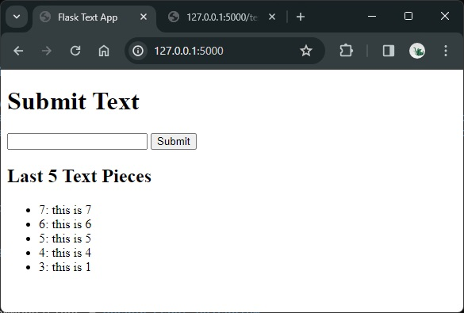
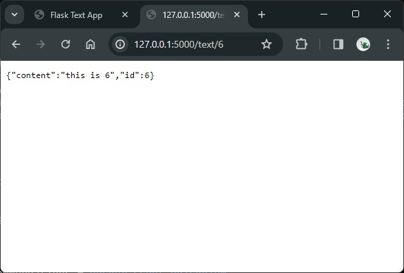

# Simple Web App

This repository contains a simple web app with a SQLite databse used to test cloud deployment functionalities.

:warning: The app is **for test puposes only**. You should not deploy an app in a container with the database inside, due to many reasons:

- The database is not scalable.
- The changes in the container are ephemeral, i.e., they disappear when the container is removed.
- etc.

However, I use this simple example for deployment tests.

The app has two functionalities; when run locally, we can access them as follows:

- Web UI: `http://127.0.0.1:5000/`: we can enter text strings to a local database; additionally, the last 5 inserted text strings are shown with their insertion id.
- REST endpoint: `127.0.0.1:5000/text/<id>`: we can get the inserted text string with the passed id.

Note that neither exception handling nor logging are implemented &mdash; on purpose.





## Setup and Local Running

I prepared this simple app to test different cloud deployment and monitoring methods. However, you can/should run it locally, too.

**Option 1: Local run with flask**

```bash
# Environment
python -m venv venv
source venv/bin/activate # venv\Scripts\activate
pip install -r requirements.txt

# Run
flask run

# App
http://127.0.0.1:5000/
# Fill in table with texts

# REST API
127.0.0.1:5000/text/<id> # e.g., 3
# Check that the correct text is returned
```

**Option 2: Docker packaging and running:**

```bash
# Simple build
docker build -t flask-text-app .
# If we have a proxy; note that the --build_arg is optional
docker build --build-arg HTTPS_PROXY=$env:HTTPS_PROXY -t flask-text-app .

# Run
docker run -p 5000:5000 flask-text-app
# If we want to override the value of the HTTP_PROXY, first set the environment variable, then:
docker run -e HTTPS_PROXY=$env:HTTPS_PROXY -p 5000:5000 flask-text-app
# If we want to create a volume instance locally mounted in the contained; that's where the DB is saved by default
docker run -v instance:/app/instance -p 5000:5000 flask-text-app

# Stop
docker ps
docker stop <id_or_name>
```

## Cloud Deployments

### Procfile

Procfiles are native to [Heroku](https://www.heroku.com/), however, they can be used by other platforms.

Any [`Procfile`](./Procfile) needs to be set with the correct `app:app` parameter, being `app:app == module_name:flask_app_instance`, e.g.:

```bash
web: gunicorn -w 4 -k gevent -b 0.0.0.0:8000 app:app
```

### Azure Deployment: App Service with Github Integration

This method is equivalent to a PaaS Heroku deployment.

Deploying a web application to Azure App Service directly from a GitHub repository is a convenient method to automate deployments. This approach is ideal for scenarios where your application doesn't require a containerized environment. Here's how to set it up:

#### Step 1: Prepare Your Application

Prepare the [`Procfile`](./Procfile):

```bash
web: gunicorn -w 4 -k gevent -b 0.0.0.0:8000 app:app
```

#### Step 2: Create an Azure App Service

1. **Log into the Azure Portal**: Visit [Azure Portal](https://portal.azure.com/).
2. **Create a Web App**:

   - Go to "Create a resource" > "Web" > "Web App".
   - Fill in the details:
     - **Subscription**: Choose your Azure subscription; e.g., `Azure subscription 1`
     - **Resource Group**: Select an existing resource group or create a new one, e.g., `rg-simple-web-app`.
     - **Name**: Enter a unique name for your web app; e.g., `simple-web-app-db`.
     - **Publish**: Select "Code".
     - **Runtime stack**: Choose the appropriate runtime for your Flask app, e.g., Python 3.9.
     - **Region**: Choose a region near you or your users.
     - **Linux Plan (App Service plan)**: Select an existing plan or create a new one.
     - **Pricing plan**: select one; e.g. `Free F1: 60 minutes/day`
   - Click "Review and create" > "Create".

#### Step 3: Configure Deployment from GitHub

1. **Open your Web App resource** in the Azure Portal.
2. **Go to Deployment Center**:
   - Navigate to the "Deployment Center" in the sidebar.
   - Choose "GitHub" as the source.
3. **Authorize Azure to Access GitHub**:
   - You'll be prompted to authenticate with GitHub and authorize Azure to access your repositories.
4. **Configure the Build Provider and Repository**:
   - For the build provider, select "App Service build service".
   - Choose your GitHub organization (or username), repository, and branch you wish to deploy.
5. **Finish the Setup**:
   - Complete the configuration and click "Save".
   - Azure will start the deployment process, pulling the latest commit from the specified branch.
   - The first deployment might fail because the app service is not created yet, but the next ones should work.

#### Step 4: Verify Deployment

- Once the deployment process is complete, you can navigate to your web app's URL (found in the "Overview" section of your Web App resource in the Azure Portal) to see your running Flask application.
  - Example: [https://simple-web-app-db.azurewebsites.net/](https://simple-web-app-db.azurewebsites.net/).
- **Continuous Deployment: Future pushes to your selected GitHub branch will trigger automatic deployments to your Azure Web App!**

The **Continuous Deployment** is achieved by *Github Actions*; a workflow is automatically generated in [`.github/workflows/main_simple-web-app-db.yml`](.github/workflows/main_simple-web-app-db.yml). That workflow has 2 jobs:

- `build`: 

```yaml
client-id: ${{ secrets.AZUREAPPSERVICE_CLIENTID_XXX }}
tenant-id: ${{ secrets.AZUREAPPSERVICE_TENANTID_XXX }}
subscription-id: ${{ secrets.AZUREAPPSERVICE_XXX }}
```
#### Step 5: Tune the Deployment: Adding Tests

```yaml
      # ...
      - name: Install dependencies
        run: pip install -r requirements.txt

      - name: Run tests
        run: |
          source venv/bin/activate
          pytest
        # Add this step to run your tests. Make sure 'pytest' is listed in your 'requirements.txt'

      - name: Zip artifact for deployment
        run: zip release.zip ./* -r
        # This step will only be reached if the tests pass
      # ...
```

```yaml
   # ...
   build:
   # ...
   test:
    needs: build
    runs-on: ubuntu-latest

    steps:
      - uses: actions/checkout@v4

      - name: Set up Python version
        uses: actions/setup-python@v1
        with:
          python-version: '3.9'

      - name: Install dependencies
        run: |
          python -m venv venv
          source venv/bin/activate
          pip install -r requirements.txt

      - name: Run pytest
        run: |
          source venv/bin/activate
          pytest
   # ...
   deploy:
   #...
```

#### Step 6: Handle Deployment

Start/Stop

#### Considerations

- **Environment Variables**: If your application requires environment variables (like database connection strings), you can set these in the "Configuration" section of your Web App resource.
- **Database**: Since your application uses SQLite, be aware that Azure App Service's file system is ephemeral. Changes to the SQLite database will be lost whenever your app is restarted or redeployed. For persistent storage, consider using an Azure-managed database service like Azure SQL Database or configuring external storage.

This setup provides a straightforward way to deploy and update your Flask application on Azure App Service directly from your GitHub repository, making it easy to manage and automate your deployment process.


